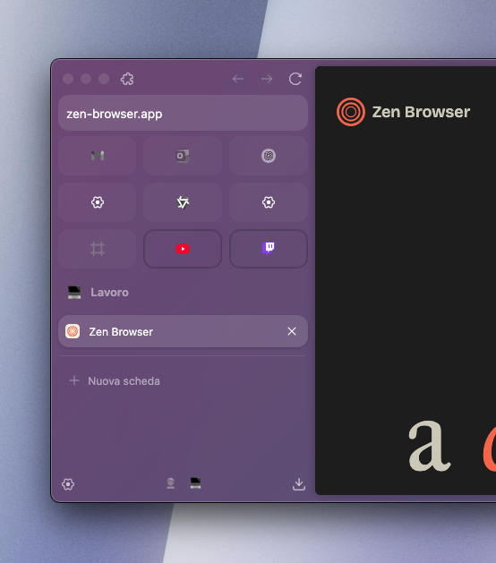

# Styler Essential Mod: Styled Essentials - Grayscale & Color

This mod for [Zen Browser](https://zen-browser.app/)  adds a dynamic visual style to the **Essentials** icons in the sidebar.

## Features

-  Icon appears in grayscale when the site is **unloaded**
-  Icon becomes colorful when the site is **active**
-  A subtle border appears around the icon when the site is active, for better visibility

## Example Screenshot

